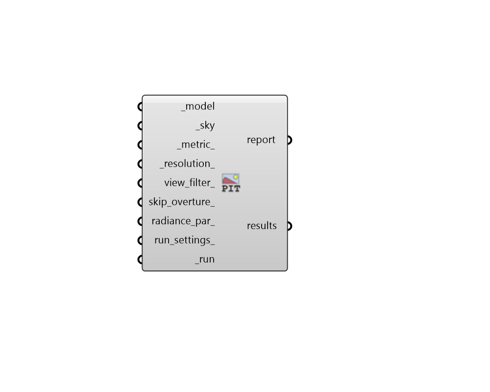

## Point-In-Time View-Based

 - [[source code]](https://github.com/ladybug-tools/honeybee-grasshopper-radiance/blob/master/honeybee_grasshopper_radiance/src//HB%20Point-In-Time%20View-Based.py)

Run a point-in-time view-based study for a Honeybee model. 

Point-in-time view-based recipes require a sky and can output High Dynamic Range (HDR) images of illuminance, irradiance, luminance or radiance. 

The `view_count_` input can be used to split each view for parallel processing, producing multiple images that are recombined into a single .HDR for the view at the end of the recipe. The recombination process automatically includes an anti-aliasing pass that smooths and improves the quality of the image. The recipe also performs an overture calculation prior to splitting each view, which results in an image with better interpolation between neighboring pixels. 

#### Inputs
* ##### model [Required]
A Honeybee Model for which a point-in-time view-based study will be run. Note that this model should have views assigned to it in order to produce meaningfule results. 
* ##### sky [Required]
A Radiance sky from any of the sky components under the "Light Sources" tab. Skies can be either CIE, ClimateBased/Custom, or for a specific Illuminance/Irradiance. This input can also just be a text definition of a sky's paramters. Examples include: 

    * cie 21 Mar 9:00 -lat 41.78 -lon -87.75 -tz 5 -type 0

    * climate-based 21 Jun 12:00 -lat 41.78 -lon -87.75 -tz 5 -dni 800 -dhi 120

    * irradiance 0
* ##### metric 
Either an integer or the full name of a point-in-time metric to be computed by the recipe. (Default: luminance). Choose from the following: 

    * 0 = illuminance

    * 1 = irradiance

    * 2 = luminance

    * 3 = radiance
* ##### resolution 
An integer for the maximum dimension of each image in pixels (either width or height depending on the input view angle and type). (Default: 800). 
* ##### view_filter 
Text for a view identifer or a pattern to filter the views of the model that are simulated. For instance, `first_floor_*` will simulate only the views that have an identifier that starts with `first_floor_`. By default, all views in the model will be simulated. 
* ##### view_count 
Number of views into which each Model view will be subdivided  for parallelized calculation. If unspecified, an attempt will be made to set this to an optimal value based on the number of workers dedicated for the simulation and the number of view in the Model. If the number of views could not be sensed, this will default to 2. 
* ##### skip_overture 
A boolean to note whether an ambient file (.amb) should be generated for an overture calculation before the view is split into smaller views. With an overture calculation, the ambient file (aka ambient cache) is first populated with values. Thereby ensuring that - when reused to create an image - Radiance uses interpolation between already calculated values rather than less reliable extrapolation. The overture calculation has comparatively small computation time to full rendering but is single-core can become time consuming in situations with a high view_count_ and workers. 
* ##### radiance_par 
Text for the radiance parameters to be used for ray tracing. (Default: -ab 2 -aa 0.25 -ad 512 -ar 16). 
* ##### run_settings 
Settings from the "HB Recipe Settings" component that specify how the recipe should be run. This can also be a text string of recipe settings. 
* ##### run [Required]
Set to True to run the recipe and get results. This input can also be the integer "2" to run the recipe silently. 

#### Outputs
* ##### report
Reports, errors, warnings, etc. 
* ##### results
High Dynamic Range (HDR) images for each View in the model. These can be plugged into the Ladybug "Image Viewer" component to preview the image. They can also be plugged into the "HB False Color" component to convert the image into a false color version. Lastly, it can be connected to the "HB HDR to GIF" component to get a GIF image that is more portable and easily previewed by different software. Pixel values are in the standard SI units of the requested input metric. 

    * illuminance = lux (aka. lm/m2)

    * irradiance = W/m2

    * luminance = cd/m2 (aka. lm/m2-sr)

    * radiance = W/m2-sr