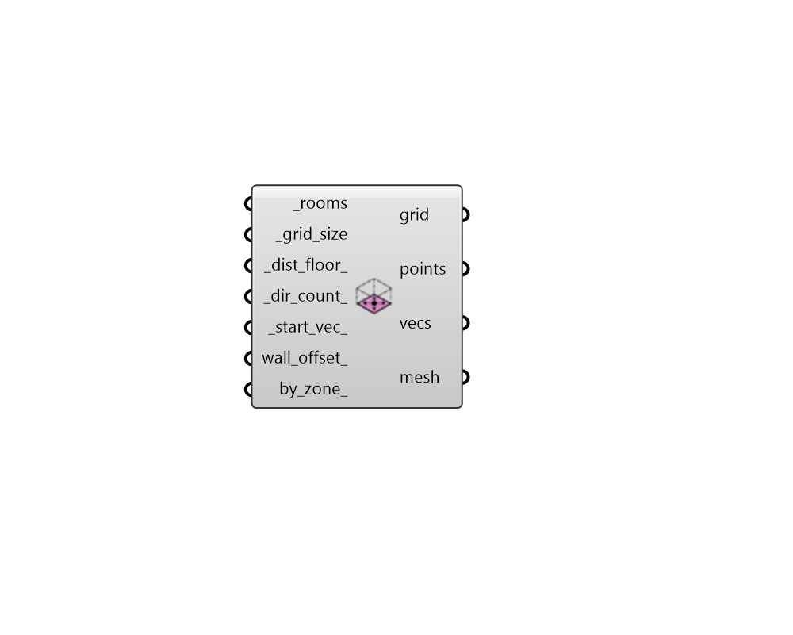

## Radial Grid from Rooms

 - [[source code]](https://github.com/ladybug-tools/honeybee-grasshopper-radiance/blob/master/honeybee_grasshopper_radiance/src//HB%20Radial%20Grid%20from%20Rooms.py)

Generate SensorGrids of radial directions around positions from the floors of rooms. 

This type of sensor grid is particularly helpful for studies of multiple view directions, such as imageless glare studies. 

The names of the grids will be the same as the rooms that they came from. 

#### Inputs
* ##### rooms [Required]
A list of honeybee Rooms for which sensor grids will be generated. This can also be an entire Honeybee Model from which Rooms will be extracted. 
* ##### grid_size [Required]
Number for the size of the grid cells. 
* ##### dist_floor 
Number for the distance to move points from the floors of the input rooms. (Default: 1.2 meters). 
* ##### dir_count 
A positive integer for the number of radial directions to be generated around each position. (Default: 8). 
* ##### start_vec 
A Vector3D to set the start direction of the generated directions. This can be used to orient the resulting sensors to specific parts of the scene. It can also change the elevation of the resulting directions since this start vector will always be rotated in the XY plane to generate the resulting directions. (Default: (0, -1, 0)). 
* ##### wall_offset 
A number for the distance at which sensors close to walls should be removed. 
* ##### by_zone 
Set to "True" to have the component generate one sensor grid per zone across the input rooms rather than one sensor grid per room. This option is useful for getting a more consolidated set of Radiance results by zone. (Default: False). 

#### Outputs
* ##### grid
A SensorGrid object that can be used in a grid-based recipe. 
* ##### points
The points that are at the center of each circle. These align with the vecs output below and can be visualized with the native Grasshopper vector display component. 
* ##### vecs
The vectors for the directions of each sensor. These align with the points output above and can be visualized with the native Grasshopper vector display component. 
* ##### mesh
Analysis mesh that can be passed to the 'Spatial Heatmap' component. 