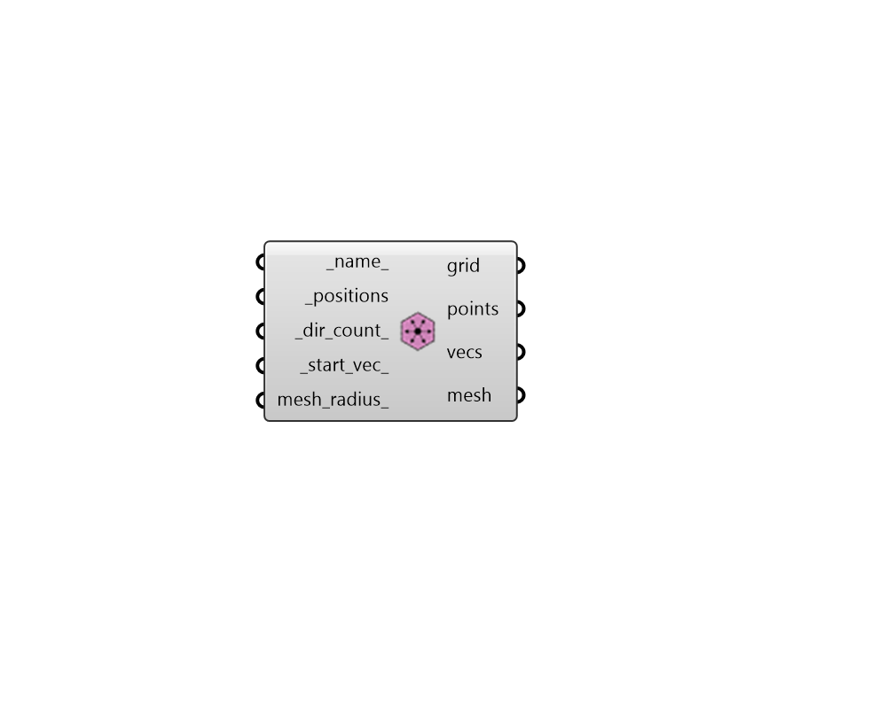

## Radial Sensor Grid

 - [[source code]](https://github.com/ladybug-tools/honeybee-grasshopper-radiance/blob/master/honeybee_grasshopper_radiance/src//HB%20Radial%20Sensor%20Grid.py)

Create a Sensor Grid object from radial directions around sensor positions. 

This type of sensor grid is particularly helpful for studies of multiple view directions, such as imageless glare studies. 

#### Inputs
* ##### name 
A name for this sensor grid. 
* ##### positions [Required]
A list or a datatree of points with one point for the position of each radial sensor. Each branch of the datatree will be considered as a separate sensor grid. 
* ##### dir_count 
A positive integer for the number of radial directions to be generated around each position. (Default: 8). 
* ##### start_vec 
A Vector3D to set the start direction of the generated directions. This can be used to orient the resulting sensors to specific parts of the scene. It can also change the elevation of the resulting directions since this start vector will always be rotated in the XY plane to generate the resulting directions. (Default: (0, -1, 0)). 
* ##### mesh_radius 
An optional number that can be used to generate a mesh that is aligned with the resulting sensors and will automatically be assigned to the grid. Such meshes will resemble a circle around each sensor with the specified radius and will contain triangular faces that can be colored with simulation results. If zero, no mesh will be generated for the sensor grid. (Default: 0.2 meters). 

#### Outputs
* ##### grid
An SensorGrid object that can be used in a grid-based recipe. 
* ##### points
Script variable SensorGrid 
* ##### vecs
Script variable SensorGrid 
* ##### mesh
Analysis mesh that can be passed to the 'Spatial Heatmap' component. 