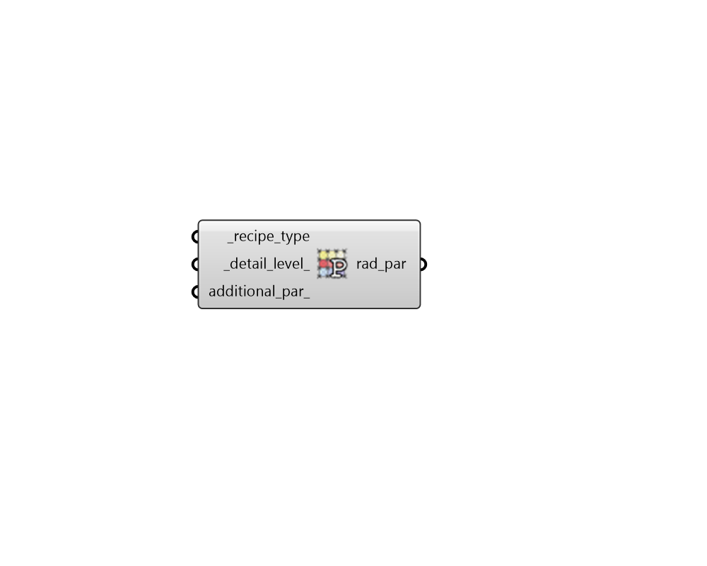

## Radiance Parameter

 - [[source code]](https://github.com/ladybug-tools/honeybee-grasshopper-radiance/blob/master/honeybee_grasshopper_radiance/src//HB%20Radiance%20Parameter.py)

Get recommended Radiance parameters given a recipe type and a level of detail. 

The original recommendation for the various Radiance paramters comes from this document. http://radsite.lbl.gov/radiance/refer/Notes/rpict_options.html 

This presentation by John Mardaljevic gives a good overview of the meaning of each radiance paramter. http://radiance-online.org/community/workshops/2011-berkeley-ca/presentations/day1/JM_AmbientCalculation.pdf 

#### Inputs
* ##### recipe_type [Required]
An integer or text for the type of recipe. Acceptable text inputs are either the full text of the recipe type (eg. point-in-time-grid) or the name of the Radiance command for which the parameters are being used (eg. rtrace). Choose from the following options. 

    * 0 | rtrace     | point-in-time-grid | daylight-factor

    * 1 | rpict      | point-in-time-view

    * 2 | rfluxmtx   | annual
* ##### detail_level 
An integer or text for the level of detail/quality for which radiance parameters will be output. (Default: 0 for low). Choose from the following options. 

    * 0 | low

    * 1 | medium

    * 2 | high
* ##### additional_par 
Text to override the Radiance parameters as needed. Radiance's standard syntax must be followed (e.g. -ps 1 -lw 0.01). 

#### Outputs
* ##### rad_par
Radiance parameters as a text string. These can be plugged into the radiance_par_ input of the various recipes. 