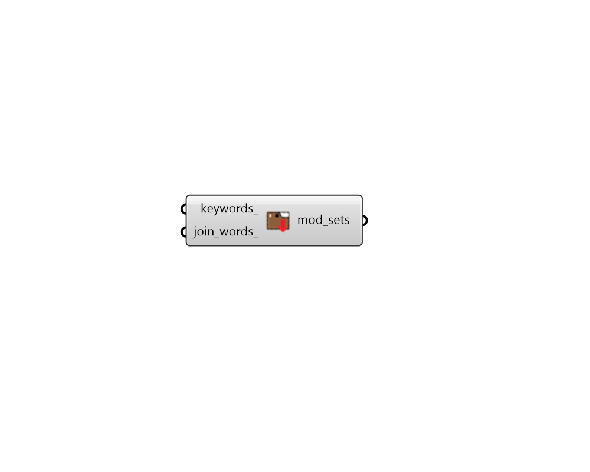

## Search Modifier Sets

 - [[source code]](https://github.com/ladybug-tools/honeybee-grasshopper-radiance/blob/master/honeybee_grasshopper_radiance/src//HB%20Search%20Modifier%20Sets.py)

Search for available Mofidier Sets within the honeybee standards library. 

#### Inputs
* ##### keywords 
Optional keywords to be used to narrow down the output list of modifier sets. If nothing is input here, all available modifier sets will be output. 
* ##### join_words 
If False or None, this component will automatically split any strings of multiple keywords (spearated by spaces) into separate keywords for searching. This results in a greater liklihood of finding an item in the search but it may not be appropropriate for all cases. You may want to set it to True when you are searching for a specific phrase that includes spaces. Default: False. 

#### Outputs
* ##### mod_sets
A list of modifier sets within the honeybee radiance standards library (filtered by keywords_ if they are input). 