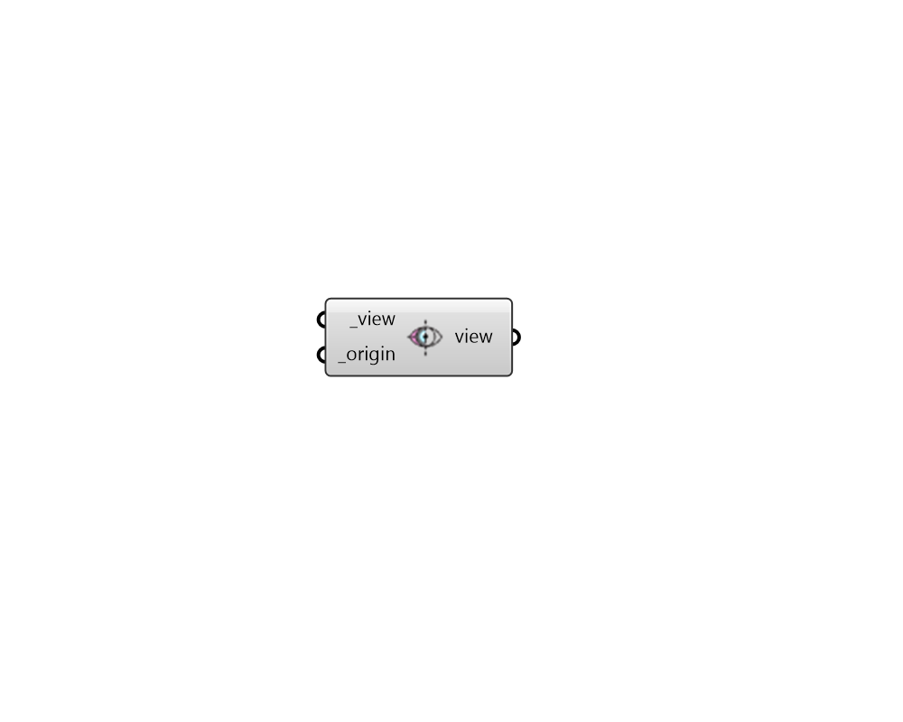

## Section Plane View

 - [[source code]](https://github.com/ladybug-tools/honeybee-grasshopper-radiance/blob/master/honeybee_grasshopper_radiance/src//HB%20Section%20Plane%20View.py)

Apply a section plane to a Honeybee Radiance View. 

The plane will always be perpendicular to the view direction for perspective and parallel view types. For fisheye view types, the clipping plane is actually a clipping sphere, centered on the view point. 

Objects in front of this imaginary plane will not be visible. This may be useful for seeing through walls (to get a longer perspective from an exterior view point) or for incremental rendering. 

#### Inputs
* ##### view [Required]
A Honeybee Radiance View object to which a section plane should be applied. 
* ##### origin [Required]
An point to set the origin of the section plane in 3D space. Note that the section plane is always perpenicular to the view direction for perspective and parallel views. 

#### Outputs
* ##### view
A Honeybee View object that can be used in a view-based recipe. 