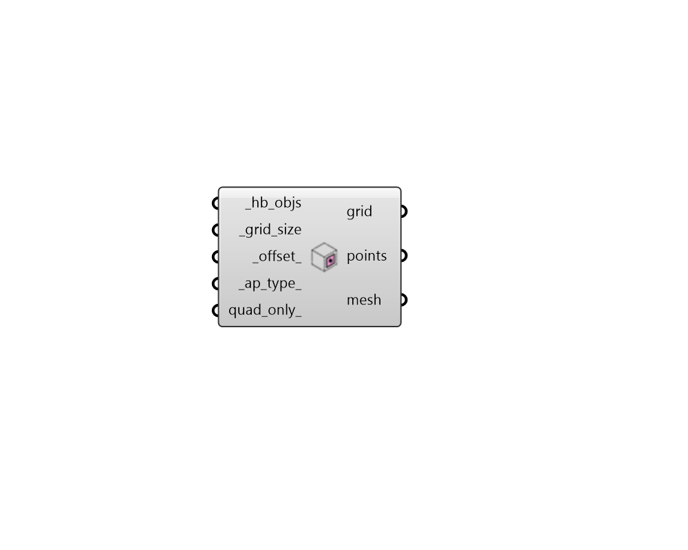

## Sensor Grid from Apertures

 - [[source code]](https://github.com/ladybug-tools/honeybee-grasshopper-radiance/blob/master/honeybee_grasshopper_radiance/src//HB%20Sensor%20Grid%20from%20Apertures.py)

Generate SensorGrid objects from exterior Apertures. 

These SensorGrids can be used in any grid-based recipe and are particularly useful for irradiance studies that evaluate solar gain of buildings, such as peak solar irradiance studies. 

#### Inputs
* ##### hb_objs [Required]
A list of honeybee Faces or Rooms for which sensor grids will be generated. This can also be an entire Honeybee Model. 
* ##### grid_size [Required]
Number for the size of the grid cells. 
* ##### offset 
Number for the distance to move points from the base geometry. Positive numbers indicate an offset towards the exterior while negative numbers indicate an offset towards the interior, essentially modeling the value of trasnmitted sun through the glass. The default is 0.1 meters. 
* ##### ap_type 
Text or an integer to specify the type of aperture that will be used to generate grids. Choose from the following. (Default: All). 

    * 1 - Window

    * 2 - Skylight

    * 3 - All
* ##### quad_only 
Boolean to note whether meshing should be done using Rhino's defaults (False), which fills the entire aperture geometry to the edges with both quad and tringulated faces, or a mesh with only quad faces should be generated. (Default: False). 

#### Outputs
* ##### grid
A SensorGrid object that can be used in a grid-based recipe. 
* ##### points
The points that are at the center of each grid cell. 
* ##### mesh
Analysis mesh that can be passed to the 'Spatial Heatmap' component. 