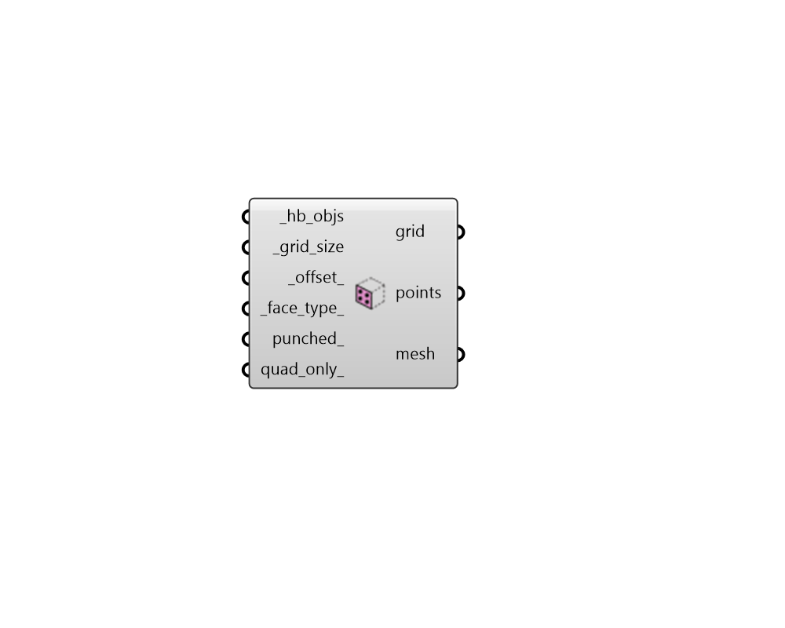

## Sensor Grid from Faces

 - [[source code]](https://github.com/ladybug-tools/honeybee-grasshopper-radiance/blob/master/honeybee_grasshopper_radiance/src//HB%20Sensor%20Grid%20from%20Faces.py)

Generate SensorGrid objects from exterior Faces (Walls, Roofs, and Floors). 

These SensorGrids can be used in any grid-based recipe and are particularly useful for radiation studies of roofs for photovoltaic potential or solar gain studies of walls. 

#### Inputs
* ##### hb_objs [Required]
A list of honeybee Faces or Rooms for which sensor grids will be generated. This can also be an entire Honeybee Model. 
* ##### grid_size [Required]
Number for the size of the grid cells. 
* ##### offset 
Number for the distance to move points from the base geometry. The default is 0.1 meters. 
* ##### face_type 
Text or an integer to specify the type of face that will be used to generate grids. Note that only Faces with Outdoors boundary conditions will be used, meaning that most Floors will typically be excluded unless they represent the underside of a cantilever. Choose from the following. (Default: Wall). 

    * 1 - Wall

    * 2 - Roof

    * 3 - Floor

    * 4 - All
* ##### punched 
Boolean to note whether the punched_geometry of the faces should be used (True) with the areas of sub-faces removed from the grid or the full geometry should be used (False). (Default:False). 
* ##### quad_only 
Boolean to note whether meshing should be done using Rhino's defaults (False), which fills the entire face geometry to the edges with both quad and tringulated faces, or a mesh with only quad faces should be generated. (Default: False). 

#### Outputs
* ##### grid
A SensorGrid object that can be used in a grid-based recipe. 
* ##### points
The points that are at the center of each grid cell. 
* ##### mesh
Analysis mesh that can be passed to the 'Spatial Heatmap' component. 