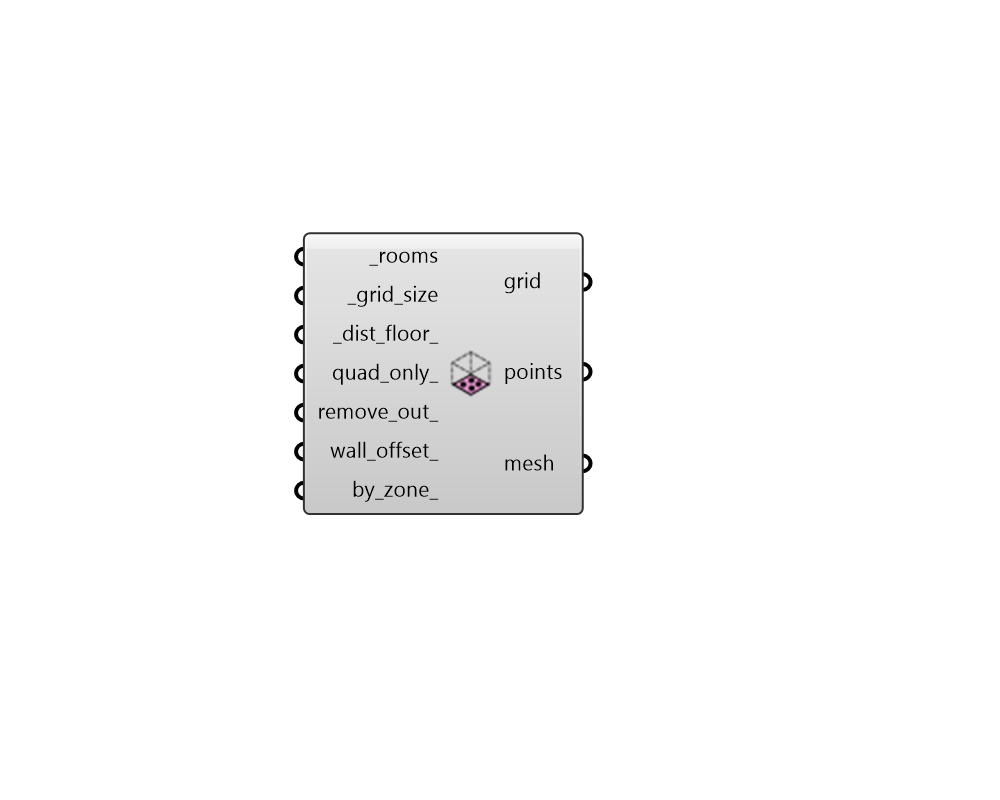

## Sensor Grid from Rooms

 - [[source code]](https://github.com/ladybug-tools/honeybee-grasshopper-radiance/blob/master/honeybee_grasshopper_radiance/src//HB%20Sensor%20Grid%20from%20Rooms.py)

Generate SensorGrid objects from the floors of honeybee Rooms. These SensorGrids can be used in a grid-based recipe. 

The names of the grids will be the same as the rooms that they came from. 

#### Inputs
* ##### rooms [Required]
A list of honeybee Rooms for which sensor grids will be generated. This can also be an entire Honeybee Model from which Rooms will be extracted. 
* ##### grid_size [Required]
Number for the size of the grid cells. 
* ##### dist_floor 
Number for the distance to move points from the floors of the input rooms. The default is 0.8 meters. 
* ##### quad_only 
Boolean to note whether meshing should be done using Rhino's defaults (False), which fills the entire floor geometry to the edges with both quad and tringulated faces, or a mesh with only quad faces should be generated. 
FOR ADVANCED USERS: This input can also be a vector object that will be used to set the orientation of the quad-only grid. Note that, if a vector is input here that is not aligned with the plane of the room's floors, an error will be raised. 
* ##### remove_out 
Boolean to note whether an extra check should be run to remove sensor points that lie outside the Room volume. Note that this can add significantly to the component's run time and this check is usually not necessary in the case that all walls are vertical and all floors are horizontal (Default: False). 
* ##### wall_offset 
A number for the distance at which sensors close to walls should be removed. 
* ##### by_zone 
Set to "True" to have the component generate one sensor grid per zone across the input rooms rather than one sensor grid per room. This option is useful for getting a more consolidated set of Radiance results by zone. (Default: False). 

#### Outputs
* ##### grid
A SensorGrid object that can be used in a grid-based recipe. 
* ##### points
The points that are at the center of each grid cell. 
* ##### mesh
Analysis mesh that can be passed to the 'Spatial Heatmap' component. 