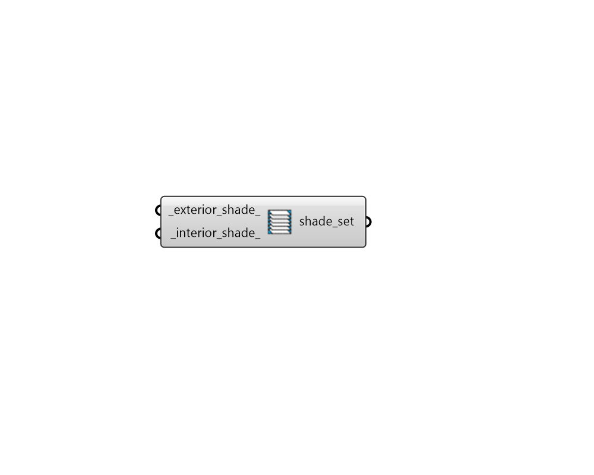

## Shade Modifier Subset

 - [[source code]](https://github.com/ladybug-tools/honeybee-grasshopper-radiance/blob/master/honeybee_grasshopper_radiance/src//HB%20Shade%20Modifier%20Subset.py)

Create a list of modifiers that can be used to edit or create a ModifierSet object. 

#### Inputs
* ##### exterior_shade 
A modifier object for exterior shades (or text for the identifier of the modifier within the library). 
* ##### interior_shade 
A modifier object for interior shades (or text for the identifier of the modifier within the library). 

#### Outputs
* ##### shade_set
A list of shade modifiers that can be used to edit or create a ModifierSet object. 