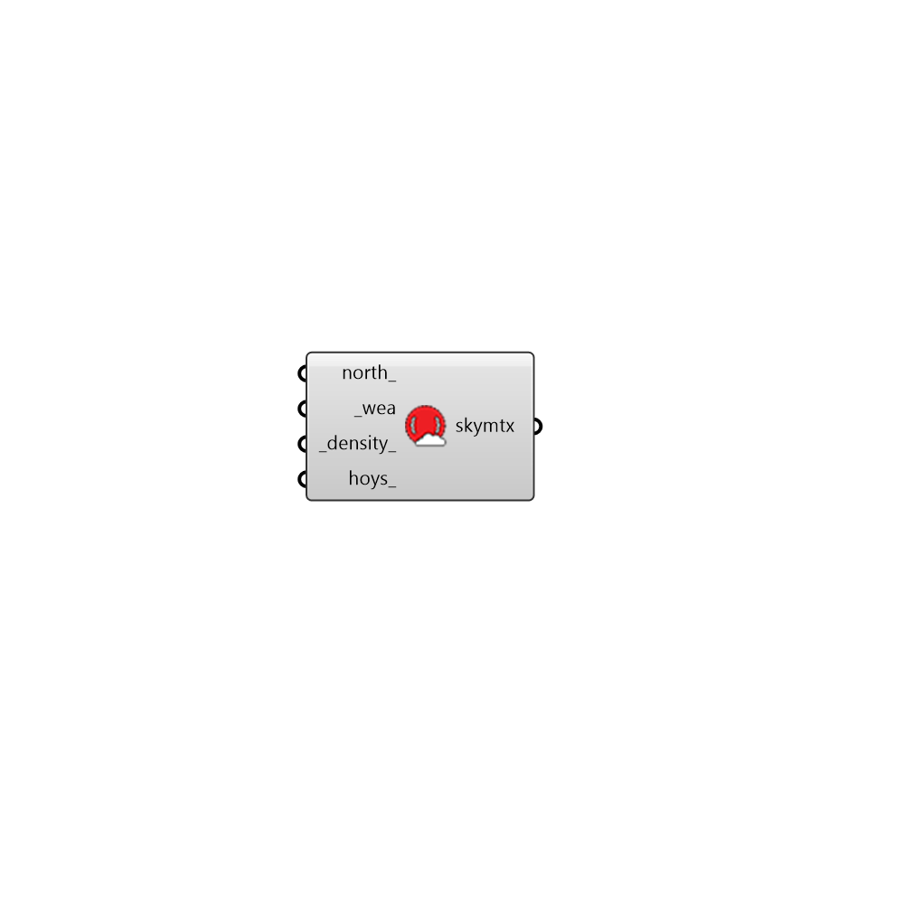

## Sky Matrix

 - [[source code]](https://github.com/ladybug-tools/honeybee-grasshopper-radiance/blob/master/honeybee_grasshopper_radiance/src//HB%20Sky%20Matrix.py)

Create a Sky Matrix from Wea. 

#### Inputs
* ##### north 
A number between 0 and 360 that represents the degrees off from the y-axis to make North. This can also be a vector to set the North. Default is 0. The default North direction is the Y-axis (0 degrees). 
* ##### wea [Required]
Ladybug Wea object. 
* ##### density 
A positive intger for sky density. [1] Tregenza Sky, [2] Reinhart Sky, etc. (Default: 1) 
* ##### hoys 
Optional list of numbers for the hours of the year to be included in the sky matrix [0-8759]. 

#### Outputs
* ##### skymtx
Sky matrix for multi-phase daylight analysis. 