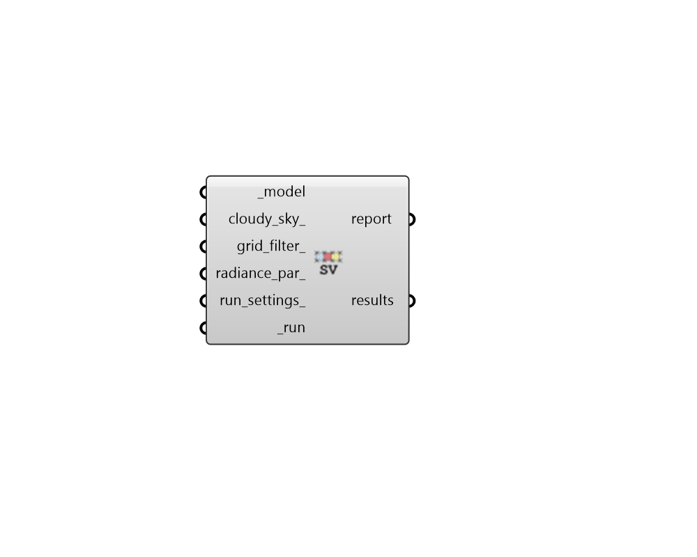

## Sky View

 - [[source code]](https://github.com/ladybug-tools/honeybee-grasshopper-radiance/blob/master/honeybee_grasshopper_radiance/src//HB%20Sky%20View.py)

Run a Sky View (SV) study for a Honeybee model. 

Sky View is defined as the percent of the sky dome seen by a surface. These can be computed either using a uniform (default) sky or a cloudy sky. 

Note that computing cloudy Sky View for a vertically-oriented geometry (horizontal sensor direction) will yield Vertical Sky Component (VSC) as described by the UK Building Research Establishment (BRE). VSC is defined as the ratio of cloudy sky illuminance falling on a vertical wall to the simultaneous horizontal illuminance under an unobstructed sky [Littlefair, 1991]. 

Also note that this recipe still respects the transparency of objects, reducing the percentage of the sky visible through a certain geometry by the transmittance of that geometry. 

#### Inputs
* ##### model [Required]
A Honeybee Model for which Sky View or Wky Exposure will be simulated. Note that this model should have grids assigned to it in order to produce meaningful results. 
* ##### cloudy_sky 
A boolean to note whether a uniform sky should be used  (False) or a cloudy overcast sky (True). (Default: False). 
* ##### grid_filter 
Text for a grid identifer or a pattern to filter the sensor grids of the model that are simulated. For instance, `first_floor_*` will simulate only the sensor grids that have an identifier that starts with `first_floor_`. By default, all grids in the model will be simulated. 
* ##### radiance_par 
Text for the radiance parameters to be used for ray tracing. (Default: -ab 2 -aa 0.1 -ad 2048 -ar 64). 
* ##### run_settings 
Settings from the "HB Recipe Settings" component that specify how the recipe should be run. This can also be a text string of recipe settings. 
* ##### run [Required]
Set to True to run the recipe and get results. 

#### Outputs
* ##### report
Reports, errors, warnings, etc. 
* ##### results
Numbers for the sky view or sky exposure at each sensor. These can be plugged into the "LB Spatial Heatmap" component along with meshes of the sensor grids to visualize results. Values are in percent (between 0 and 100). 