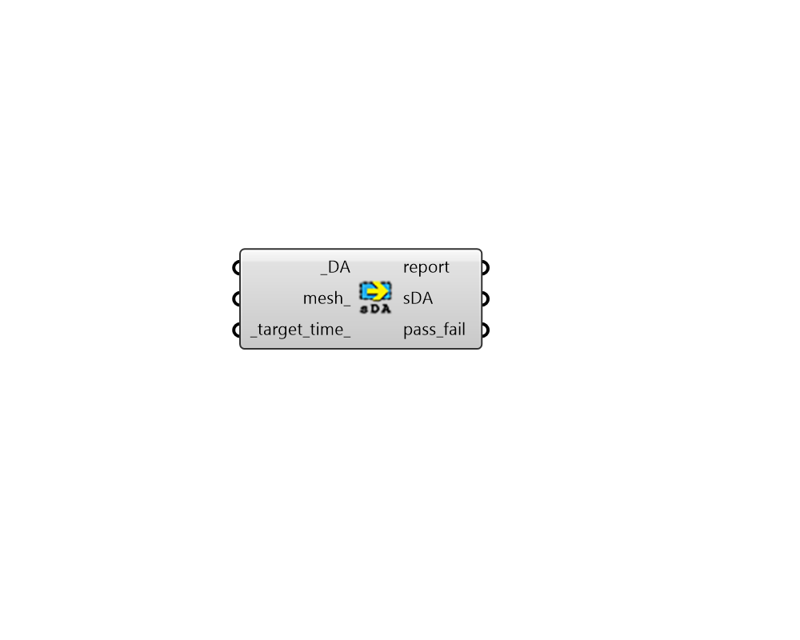

## Spatial Daylight Autonomy

 - [[source code]](https://github.com/ladybug-tools/honeybee-grasshopper-radiance/blob/master/honeybee_grasshopper_radiance/src//HB%20Spatial%20Daylight%20Autonomy.py)

Calculate Spatial Daylight Autonomy (sDA) from lists of daylight autonomy values. 

As per IES-LM-83-12 Spatial Daylight Autonomy (sDA) is a metric describing annual sufficiency of ambient daylight levels in interior environments. It is defined as the percent of an analysis area (the area where calcuations are performed -typically across an entire space) that meets a minimum daylight illuminance level for a specified fraction of the operating hours per year. The sDA value is expressed as a percentage of area. 

Note: This component will only output a LEED compliant sDA if you've run the simulation with dynamic blinds and blind schedules as per the IES-LM-83-12 standard. If you are not using dynamic blinds, then this output is NOT LEED compliant. 

#### Inputs
* ##### DA [Required]
A data tree of daylight autonomy values output from the "HB Annual Dalyight" recipe or the "HB Annual Daylight Metrics" component. Note that, unless these DA values follow LM83 dynamic blinds setup, the resulting sDA is not LEED compliant. 
* ##### mesh 
An optional list of Meshes that align with the _DA data tree above, which will be used to assign an area to each sensor. If no mesh is connected here, it will be assumed that each sensor represents an equal area to all of the others. 
* ##### target_DA 
A number for the minimum target value for daylight autonomy at wich a given sensor is considered well daylit. (default: 50). 

#### Outputs
* ##### report
Reports, errors, warnings, etc. 
* ##### sDA
Spatial daylight autonomy as percentage of area for each analysis grid. 
* ##### pass_fail
A data tree of zeros and ones, which indicate whether a given senor passes the criteria for being daylit (1) or fails the criteria (0). Each value is for a different sensor of the grid. These can be plugged into the "LB Spatial Heatmap" component along with meshes of the sensor grids to visualize results. 