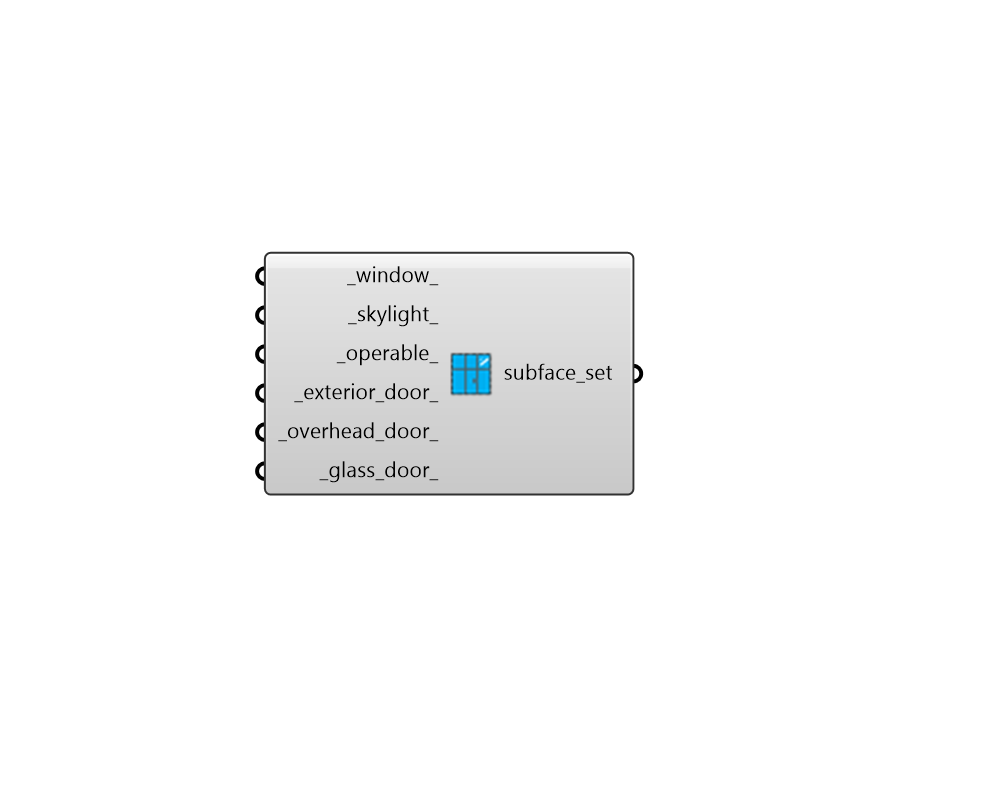

## Subface Modifier Subset

 - [[source code]](https://github.com/ladybug-tools/honeybee-grasshopper-radiance/blob/master/honeybee_grasshopper_radiance/src//HB%20Subface%20Modifier%20Subset.py)

Create a list of exterior subface (apertures + doors) modifiers that can be used to edit or create a ModifierSet object. 

#### Inputs
* ##### window 
A modifier object for apertures with an Outdoors boundary condition and a Wall face type for their parent face. This can also be text for the identifier of the modifier within the library. 
* ##### skylight 
A modifier object for apertures with an Outdoors boundary condition and a RoofCeiling or Floor face type for their parent face. This can also be text for the identifier of the modifier within the library. 
* ##### operable 
A modifier object for apertures with an Outdoors boundary condition and True is_operable property. This can also be text for the identifier of the modifier within the library. 
* ##### exterior_door 
A modifier object for opaque doors with an Outdoors boundary condition and a Wall face type for their parent face. This can also be text for the identifier of the modifier within the library. 
* ##### overhead_door 
A modifier object for opaque doors with an Outdoors boundary condition and a RoofCeiling or Floor face type for their parent face. This can also be text for the identifier of the modifier within the library. 
* ##### glass_door 
A modifier object for all glass doors with an Outdoors boundary condition. This can also be text for the identifier of the modifier within the library. 

#### Outputs
* ##### subface_set
A list of exterior subface modifiers that can be used to edit or create a ModifierSet object. 