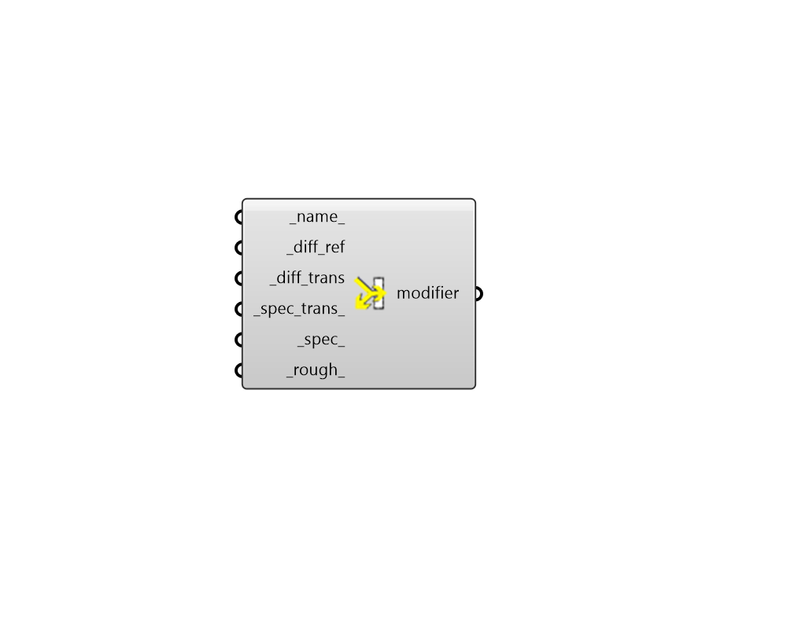

## Translucent Modifier

 - [[source code]](https://github.com/ladybug-tools/honeybee-grasshopper-radiance/blob/master/honeybee_grasshopper_radiance/src//HB%20Translucent%20Modifier.py)

Create a translucent radiance modifier from a reflectances and transmittances. 

#### Inputs
* ##### name 
Text to set the name for the modifier and to be incorporated into a unique modifier identifier. 
* ##### diff_ref [Required]
A number between 0 and 1 for the opaque diffuse reflectance. This reflectance will be the same for the red, green and blue channels. 
* ##### diff_trans [Required]
A number between 0 and 1 for the transmitted diffuse component. This is the fraction of transmitted light that is diffusely scattered. 
* ##### spec_trans [Required]
A number between 0 and 1 for the transmitted specular component. This is the fraction of transmitted light that is not diffusely scattered but passes through like a beam. 
* ##### spec 
A number between 0 and 1 for the fraction of specularity. Specularity fractions greater than 0.1 are not common in non-metallic materials. (Default: 0). 
* ##### rough 
Roughness is specified as the rms slope of surface facets. A value of 0 corresponds to a perfectly smooth surface, and a value of 1 would be a very rough surface. Roughness values greater than 0.2 are not very realistic. (Default: 0). 

#### Outputs
* ##### modifier
A translucent modifier that can be assigned to a Honeybee geometry or Modifier Sets. 