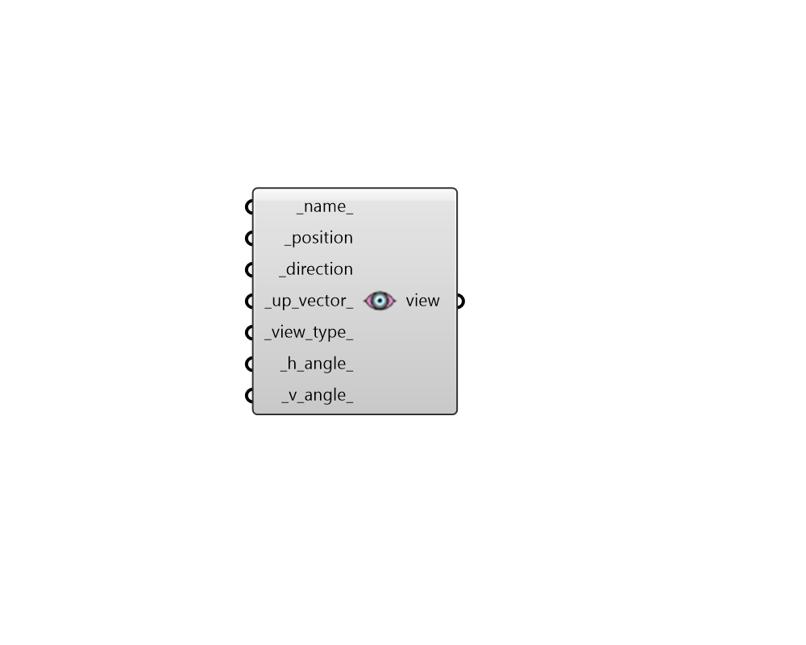

## View

 - [[source code]](https://github.com/ladybug-tools/honeybee-grasshopper-radiance/blob/master/honeybee_grasshopper_radiance/src//HB%20View.py)

Create a Honeybee View for an image-based analysis. 

#### Inputs
* ##### name 
Text to set the name for the modifier and to be incorporated into a unique modifier identifier. 
* ##### position [Required]
An point to set the position of the view in 3D space (-vp). This is the focal point of a perspective view or the center of a parallel projection. 
* ##### direction [Required]
A vector for the direction that the veiw is facing (-vd). The length of this vector indicates the focal distance as needed by the pixel depth of field (-pd) in rpict. 
* ##### up_vector 
An optional vector to set the vertical direction of the view (-vu). (Default: (0, 0, 1)). 
* ##### view_type 
An integer to set the view type (-vt). Choose from the choices below. (Default: 0). 

    * 0 Perspective (v)

    * 1 Hemispherical fisheye (h)

    * 2 Parallel (l)

    * 3 Cylindrical panorama (c)

    * 4 Angular fisheye (a)

    * 5 Planisphere [stereographic] projection (s)For more detailed description about view types check rpict manual page (http://radsite.lbl.gov/radiance/man_html/rpict.1.html) 
* ##### h_angle 
A number for the view horizontal size (-vh) in degrees. For a perspective projection (including fisheye views), val is the horizontal field of view. For a parallel projection, val is the view width in world coordinates. (Default: 60). 
* ##### v_angle 
A number for the view vertical size (-vv) in degrees. For a perspective projection (including fisheye views), val is the horizontal field of view. For a parallel projection, val is the view width in world coordinates. (Default: 60). 

#### Outputs
* ##### view
A Honeybee View object that can be used in an view-based recipe. 