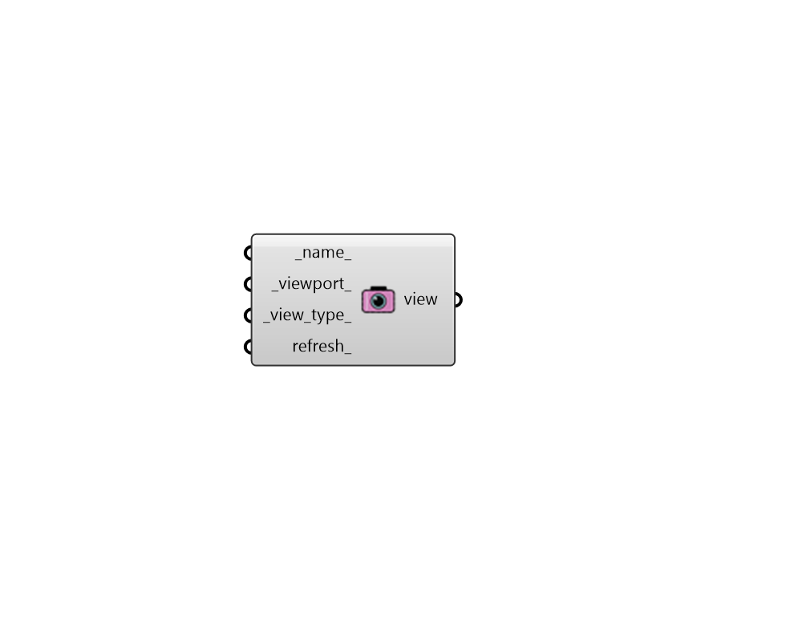

## View from Viewport

 - [[source code]](https://github.com/ladybug-tools/honeybee-grasshopper-radiance/blob/master/honeybee_grasshopper_radiance/src//HB%20View%20from%20Viewport.py)

Create a Honeybee View for an image-based analysis using a Rhino viewport. 

#### Inputs
* ##### name 
Text to set the name for the modifier and to be incorporated into a unique modifier identifier. 
* ##### viewport 
The Rhino viewport name which will be used to generate a radiance View object. Typical inputs include "Perspective", "Top", "Bottom", "Left", "Right", "Front", "Back" or any viewport name that you have saved within the Rhino file.  If no text is input here, the default will be the currently active viewport (the last viewport in which you navigated). 
* ##### view_type 
An integer to set the view type (-vt). Choose from the choices below. Default: 0 if the viewport is in perspective; 2 if it is parallel. 

    * 0 Perspective (v)

    * 1 Hemispherical fisheye (h)

    * 2 Parallel (l)

    * 3 Cylindrical panorama (c)

    * 4 Angular fisheye (a)

    * 5 Planisphere [stereographic] projection (s)For more detailed description about view types check rpict manual page (http://radsite.lbl.gov/radiance/man_html/rpict.1.html) 
* ##### refresh 
Connect a Grasshopper "button" component to refresh the orientation upon hitting the button. 

#### Outputs
* ##### view
A Honeybee View object that can be used in an image-based recipe. 