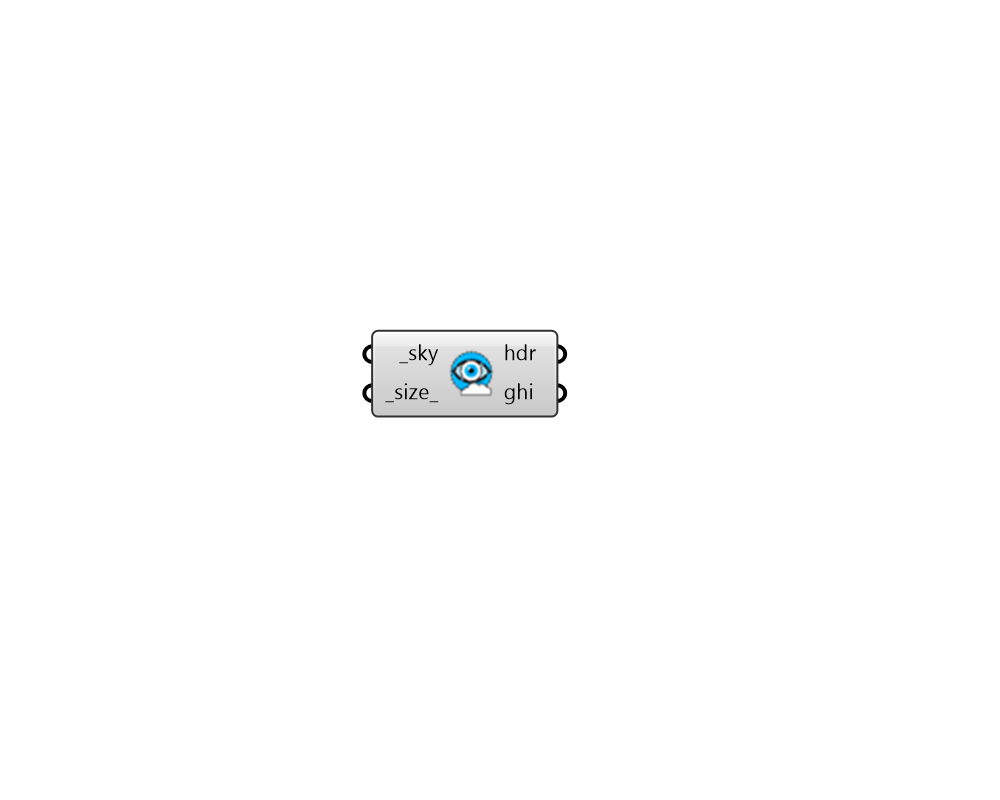

## Visualize Sky

 - [[source code]](https://github.com/ladybug-tools/honeybee-grasshopper-radiance/blob/master/honeybee_grasshopper_radiance/src//HB%20Visualize%20Sky.py)

Visualize a sky as a High Dynamic Range (HDR) image file. 

#### Inputs
* ##### sky [Required]
A Radiance sky from any of the sky components under the "Light Sources" tab. Text string representations of skies are also acceptable. 
* ##### size 
A number for the X and Y dimension of the imgae in pixles. (Default: 500 px) 

#### Outputs
* ##### hdr
Path to the High Dynamic Range (HDR) image file of the sky. This can be plugged into the Ladybug "Image Viewer" component to preview the image. It can also be plugged into the "HB False Color" component to convert the image into a false color version. Lastly, it can be connected to the "HB HDR to GIF" component to get a GIF image that is more portable and easily previewed by different software. 
* ##### ghi
The global horizontal irradiance (W/m2) for an upstructed test point under the sky. 