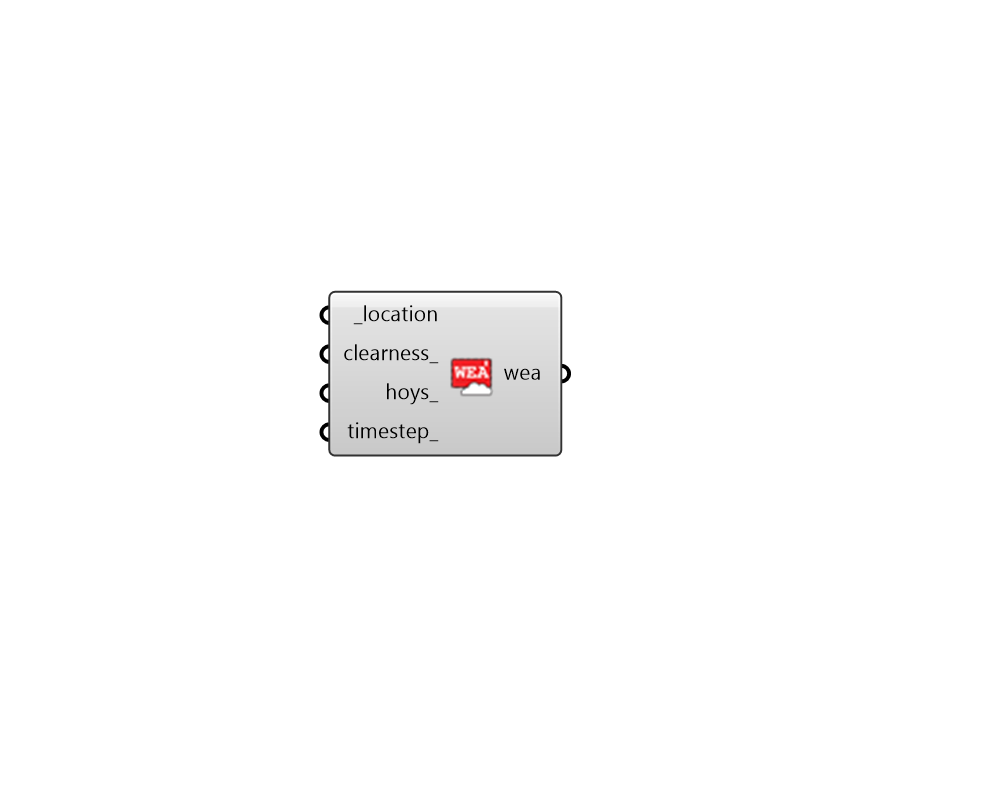

## Wea From Clear Sky

 - [[source code]](https://github.com/ladybug-tools/honeybee-grasshopper-radiance/blob/master/honeybee_grasshopper_radiance/src//HB%20Wea%20From%20Clear%20Sky.py)

Create a WEA object using the original ASHRAE Clear Sky formula. 

#### Inputs
* ##### location [Required]
A Ladybug Location object which will set the sun poisition for the clear sky Wea. Locations can be obtained from the "LB Import EPW" or the "LB Construct Location" component. 
* ##### clearness 
A factor to be multiplied by the output of the clear sky model. This is to help account for locations where clear, dry skies predominate (e.g., at high elevations) or, conversely, where hazy and humid conditions are frequent. See Threlkeld and Jordan (1958) for recommended values. Typical values range from 0.95 to 1.05 and are usually never more than 1.2. (Default: 1.0). 
* ##### hoys 
An optional list of hours of the year (numbers from 0 to 8759) for which the Wea will be filtered. HOYs can be generated from the "LB Analysis Period" component or they can be obtained through other means like analysis of the values in an occupancy schedule. By default, the Wea will be generated for the whole year. 
* ##### timestep 
An integer representing the timestep with which to make the WEA object. (Default: 1, for 1 step per hour of the year). 

#### Outputs
* ##### wea
A wea object from stat file. This wea object represents an original  ASHRAE Clear Sky, which is intended to determine peak solar load and sizing parmeters for HVAC systems. 