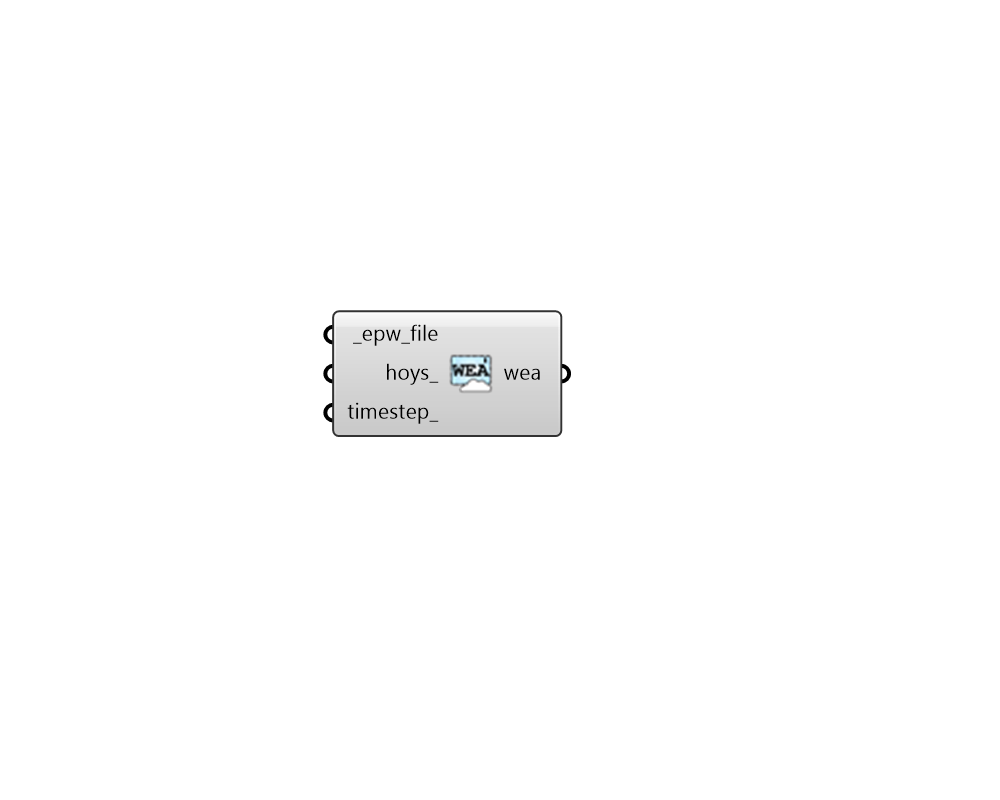

## Wea From EPW

 - [[source code]](https://github.com/ladybug-tools/honeybee-grasshopper-radiance/blob/master/honeybee_grasshopper_radiance/src//HB%20Wea%20From%20EPW.py)

Create a Wea object from an EPW file. 

#### Inputs
* ##### epw_file [Required]
Full path to an .epw weather file. 
* ##### hoys 
An optional list of hours of the year (numbers from 0 to 8759) for which the Wea will be filtered. HOYs can be generated from the "LB Analysis Period" component or they can be obtained through other means like analysis of the values in an occupancy schedule. By default, the Wea will be generated for the whole year. 
* ##### timestep 
An integer representing the timestep with which to make the  WEA object.  Default is set to 1 for 1 step per hour of the year. 

#### Outputs
* ##### wea
A wea object from epw file. 