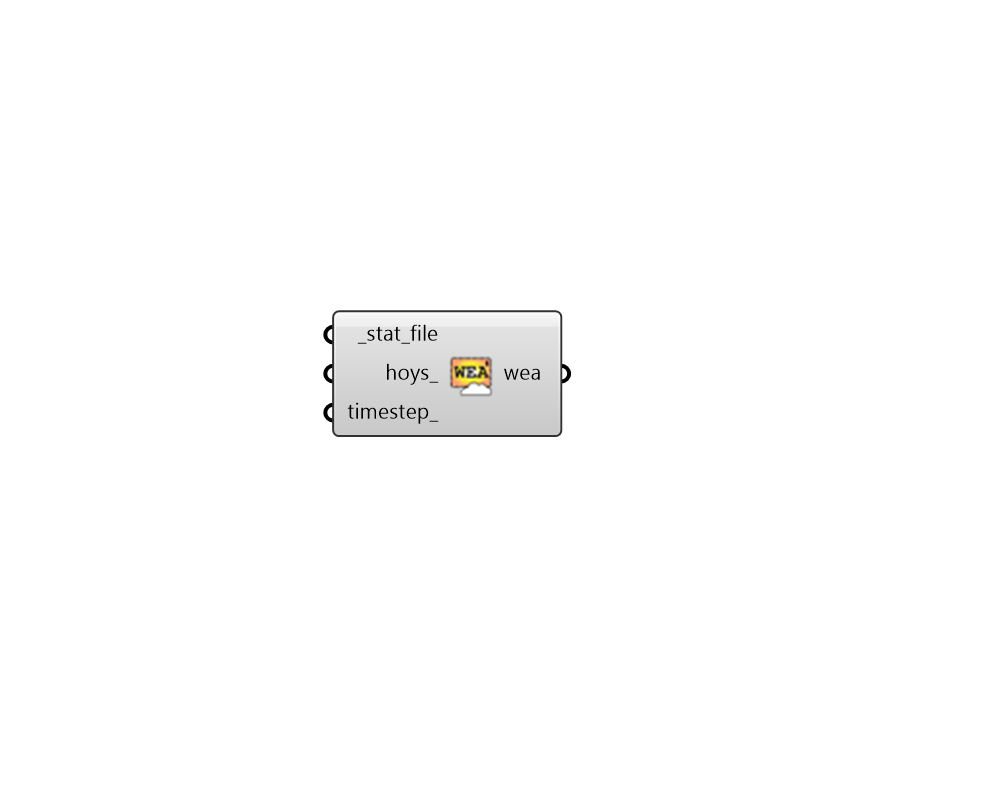

## Wea From Tau Clear Sky

 - [[source code]](https://github.com/ladybug-tools/honeybee-grasshopper-radiance/blob/master/honeybee_grasshopper_radiance/src//HB%20Wea%20From%20Tau%20Clear%20Sky.py)

Create a WEA object for an ASHRAE Revised Clear Sky (Tau Model) using a STAT file. 

#### Inputs
* ##### stat_file [Required]
Full path to .stat file that will be used to make the clear sky Wea. Note that an error will be raised if no atmospheric optical data is found in the file. In this case, the "HB Wea from Clear Sky" component can be used. 
* ##### hoys 
An optional list of hours of the year (numbers from 0 to 8759) for which the Wea will be filtered. HOYs can be generated from the "LB Analysis Period" component or they can be obtained through other means like analysis of the values in an occupancy schedule. By default, the Wea will be generated for the whole year. 
* ##### timestep 
An integer representing the timestep with which to make the  WEA object.  Default is set to 1 for 1 step per hour of the year. 

#### Outputs
* ##### wea
A wea object from stat file. This wea object represents an ASHRAE Revised  Clear Sky ("Tau Model"), which is intended to determine peak solar load and sizing parmeters for HVAC systems. The "Tau Model" uses monthly optical depths found within a .stat file. 