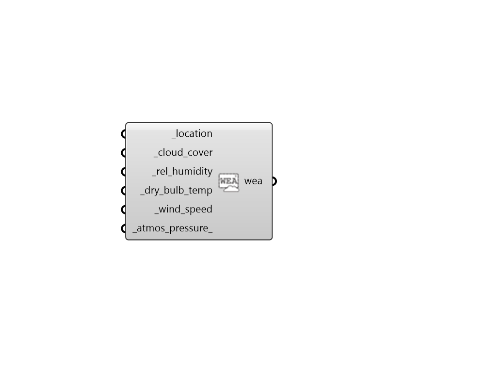

## Wea from Zhang-Huang

 - [[source code]](https://github.com/ladybug-tools/honeybee-grasshopper-radiance/blob/master/honeybee_grasshopper_radiance/src//HB%20Wea%20from%20Zhang-Huang.py)

Construct a WEA from hourly data collections and the Zhang-Huang Solar Model. 

#### Inputs
* ##### location [Required]
A Ladybug Location object. 
* ##### cloud_cover [Required]
Hourly DataCollection with the fraction of total sky cover (tenths of coverage). (eg. 1 is 1/10 covered. 10 is total coverage) 
* ##### rel_humidity [Required]
Hourly DataCollection with relative humidity [%]. 
* ##### dry_bulb_temp [Required]
Hourly DataCollection with dry bulb temperature [C]. 
* ##### wind_speed [Required]
Hourly DataCollection with wind speed [m/s]. 
* ##### atmos_pressure 
Hourly DataCollection with amtospheric pressure [Pa]. If no value is connected here, pressure at sea level will be assumed (101,325 Pa). 

#### Outputs
* ##### wea
A wea object from the input data collections and the Zhang-Huang solar model. 